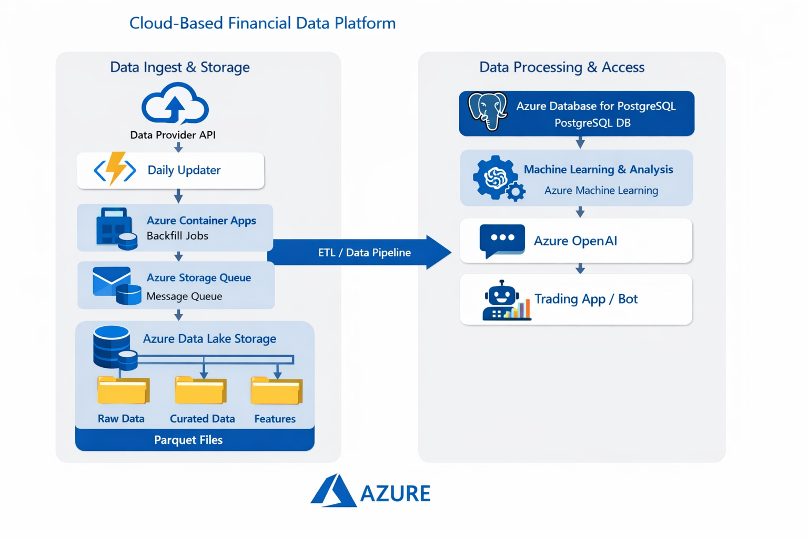

# Components architecture

# Azure overview
The diagram illustrates a **cloud-based financial data platform built on Microsoft Azure**, designed to ingest, store, process, analyze, and ultimately trade on historical and daily-updated market data.

The architecture follows a **clear separation of concerns**:

- **Data Ingest & Storage (left side)**  
  Responsible for acquiring market data from external providers, handling both historical backfills and daily incremental updates, and storing data in a scalable, cost-efficient data lake.

- **Data Processing & Access (right side)**  
  Provides structured access to the data for analytics, machine learning, LLM-based analysis, and trading applications using databases and managed AI services.

An **ETL / Data Pipeline** connects these layers, ensuring data flows from raw ingestion through curated storage to downstream consumers in a controlled and reproducible way.

The design is intentionally modular so that the platform can start small (single index, daily bars) and evolve into a multi-asset, ML-driven trading system.

## Component-level description

### Data Provider API

External market data sources that supply historical and daily price data (e.g. indices, equities, commodities, rates).

Responsibilities:
- Provide market data via REST or similar APIs
- Act as an external dependency to the platform
- Support multiple vendors over time

---

### Azure Functions – Daily Updater

A serverless Python-based ingestion component responsible for **incremental daily updates**.

Responsibilities:
- Run on a scheduled trigger (e.g. once per trading day)
- Request new market data since the last successful ingestion
- Persist raw data to the data lake
- Update ingestion metadata in PostgreSQL

Why this component:
- Low operational overhead
- No server management
- Cost-effective for predictable, low-volume workloads

---

### Azure Container Apps – Backfill Jobs

Containerized batch jobs used for **historical data ingestion** and large backfills.

Responsibilities:
- Ingest large historical date ranges
- Process multiple instruments or timeframes
- Execute on demand and terminate when complete

Why this component:
- Better suited for long-running or compute-intensive tasks
- Enables parallel ingestion
- Avoids overloading serverless functions

---

### Azure Storage Queue

A lightweight message queue used to **decouple ingestion orchestration from execution**.

Responsibilities:
- Store ingestion tasks (symbol, timeframe, date range)
- Enable parallel processing by multiple workers
- Provide retry and fault tolerance mechanisms

Why this component:
- Improves system resilience
- Simplifies scaling ingestion horizontally
- Keeps ingestion logic modular

---

### Azure Data Lake Storage Gen2

The **system of record** for all market data.

Data organization:
- Raw data (vendor-native, immutable)
- Curated data (cleaned, validated, normalized)
- Feature data (derived indicators and ML features)

Key characteristics:
- Uses Parquet files for efficient analytics
- Partitioned by symbol, timeframe, and date
- Optimized for large-scale historical analysis

---

### ETL / Data Pipeline

The logical data flow that connects ingestion and consumption layers.

Responsibilities:
- Transform raw data into curated datasets
- Enforce schemas and data quality rules
- Ensure idempotent and reproducible processing

Note:
This is a conceptual layer implemented across Azure Functions and Container Apps rather than a single Azure service.

---

### Azure Database for PostgreSQL

A relational database used for **metadata, ingestion state, and fast-access data**.

Responsibilities:
- Store instrument and dataset metadata
- Track ingestion state and health
- Optionally store “hot cache” tables for recent market data
- Serve fast queries for trading strategies

Why PostgreSQL:
- Mature and well-supported ecosystem
- Strong Python integration
- Easy extensibility for time-series or vector workloads

---

### Azure Machine Learning

A managed service for **model development and data science workflows**.

Responsibilities:
- Feature engineering and experimentation
- Model training and evaluation
- Batch inference and research pipelines

Usage:
- Optional in early phases
- Becomes central as strategies become ML-driven

---

### Azure OpenAI

Provides **large language model (LLM) capabilities** for advanced analysis and reasoning.

Responsibilities:
- Natural-language exploration of market data
- Strategy explanation and summarization
- Research assistance and insight generation

Integration:
- Consumes curated datasets and metadata
- Does not interact directly with raw ingestion

---

### Trading App / Bot

The execution layer of the platform.

Responsibilities:
- Read curated data and/or hot cache tables
- Execute trading strategies
- Interface with broker APIs (paper or live)
- Enforce risk controls and safeguards

Deployment:
- Runs as an Azure Container App
- Can be scheduled (end-of-day) or always-on (intraday)

---

## Architectural principles

- Separation of storage and compute
- Immutable raw data
- Serverless for light workloads, containers for heavy workloads
- Low fixed cost at small scale
- Clear evolution path toward automated trading